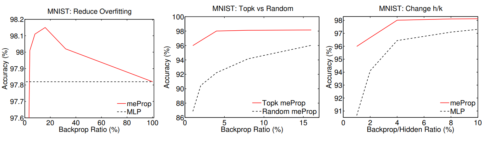

# meProp 

The codes were used for the paper _meProp: Sparsified Back Propagation for Accelerated Deep Learning with Reduced Overfitting_ (ICML 2017) [[pdf]](http://proceedings.mlr.press/v70/sun17c/sun17c.pdf) by Xu Sun, Xuancheng Ren, Shuming Ma, Houfeng Wang. 

# Introduction

We propose a simple yet effective technique to simplify the training of neural networks. The technique is based on the top-k selection of the gradients in back propagation.

In back propagation, only a small subset of the full gradient is computed to update the model parameters. The gradient vectors are sparsified in such a way that **only the top-k elements (in terms of magnitude) are kept**. As a result, only *k* rows or columns (depending on the layout) of the weight matrix are modified, leading to a linear reduction in the computational cost. We name this method **meProp** (*m*inimal *e*ffort back *prop*agation).

Surprisingly, experimental results demonstrate that most of time we only need to **update fewer than 5% of the weights** at each back propagation pass. More interestingly, the proposed method **improves the accuracy of the resulting models** rather than degrades the accuracy, and a detailed analysis is given. 

The following figure is an illustration of the idea of meProp.


**TL;DR**: Training with meProp is significantly faster than the original back propagation, and has better accuracy on all of the three tasks we used, Dependency Parsing, POS Tagging and MNIST respectively. The method works with different neural models (MLP and LSTM), with different optimizers (we tested AdaGrad and Adam), with DropOut, and with more hidden layers. The top-*k* selection works better than the random k-selection, and better than normally-trained *k*-dimensional network.

**Update**: Results on test set (please refer to the paper for detailed results and experimental settings):

| Method (Adam, CPU)      | Backprop Time (s) | Test (%)          |
| ----------------------- | ----------------- | ----------------- |
| Parsing (MLP 500d)      | 9,078             | 89.80             |
| Parsing (meProp top-20) | **489 (18.6x)**   | **88.94 (+0.04)** |
| POS-Tag (LSTM 500d)     | 16,167            | 97.22             |
| POS-Tag (meProp top-10) | **436 (37.1x)**   | **97.25 (+0.03)** |
| MNIST (MLP 500d)        | 170               | 98.20             |
| MNIST (meProp top-80)   | **29 (5.9x)**     | **98.27 (+0.07)** |

The effect of *k*, selection (top-*k* vs. random), and network dimension (top-*k* vs. *k*-dimensional):



To achieve speedups on GPUs, a slight change is made to unify the top-_k_ pattern across the mini-batch. The original meProp will cause different top-_k_ patterns across examples of a mini-batch, which will require sparse matrix multiplication. However, sparse matrix multiplication is not very efficient on GPUs compared to dense matrix multiplication on GPUs. Hence, by unifying the top-_k_ pattern, we can extract the parts of the matrices that need computation (dense matrices), get the results, and reconstruct them to the appropriate size for further computation. This leads to actual speedups on GPUs, although we believe if a better method is designed, the speedups on GPUs can be better.

See [[pdf]](https://arxiv.org/abs/1706.06197) for more details, experimental results, and analysis.


# Usage

## PyTorch

### Requirements

* Python 3.5
* PyTorch v0.1.12+ - v0.3.1
* torchvision
* CUDA 8.0

### Dataset

MNIST: The code will automatically download the dataset and process the dataset (using torchvision). See function _get_mnist_ in the pytorch code for more information.

### Run

```bash
python3.5 main.py
```

The code runs unified meProp by default. You could change the lines at the bottom of the [main.py](./src/pytorch/main.py) to run meProp using sparse matrix multiplication. Or you could pass the arguments through command line.

```
usage: main.py [-h] [--n_epoch N_EPOCH] [--d_hidden D_HIDDEN]
               [--n_layer N_LAYER] [--d_minibatch D_MINIBATCH]
               [--dropout DROPOUT] [--k K] [--unified] [--no-unified]
               [--random_seed RANDOM_SEED]

optional arguments:
  -h, --help            show this help message and exit
  --n_epoch N_EPOCH     number of training epochs
  --d_hidden D_HIDDEN   dimension of hidden layers
  --n_layer N_LAYER     number of layers, including the output layer
  --d_minibatch D_MINIBATCH
                        size of minibatches
  --dropout DROPOUT     dropout rate
  --k K                 k in meProp (if invalid, e.g. 0, do not use meProp)
  --unified             use unified meProp
  --no-unified          do not use unified meProp
  --random_seed RANDOM_SEED
                        random seed
```
The results will be written to stdout by default, but you could change the argument _file_ when initializing the _TestGroup_ to write the results to a file. 

The code supports simple unified meProp in addition. Please notice, this code will use GPU 0 by default.


## C#

### Requirements

* Targeting Microsoft .NET Framework 4.6.1+
* Compatible versions of Mono should work fine (tested Mono 5.0.1)
* Developed with Microsoft Visual Studio 2017

### Dataset

MNIST: Download from [link](http://yann.lecun.com/exdb/mnist/). Extract the files, and place them at the same location with the executable.

### Run

Compile the code first, or use the executable provided in releases.

Then
```
nnmnist.exe <config.json>
```
or
```
mono nnmnist.exe <config.json>
```
where <config.json> is a configuration file. There is [an example configuration file](./src/csharp/nnmnist/default.json) in the source codes. The example configuration file runs the baseline model. Change the NetType to _mlptop_ for experimenting with meProp, and to _mlpvar_ for experimenting with meSimp. The output will be written to a file at the same location with the executable. 

The code supports random _k_ selection in addition.

# Citation

bibtex:
```
@InProceedings{sun17meprop,
  title = 	 {me{P}rop: Sparsified Back Propagation for Accelerated Deep Learning with Reduced Overfitting},
  author = 	 {Xu Sun and Xuancheng Ren and Shuming Ma and Houfeng Wang},
  booktitle = 	 {Proceedings of the 34th International Conference on Machine Learning},
  pages = 	 {3299--3308},
  year = 	 {2017},
  volume = 	 {70},
  series = 	 {Proceedings of Machine Learning Research},
  address = 	 {International Convention Centre, Sydney, Australia}
}
```
